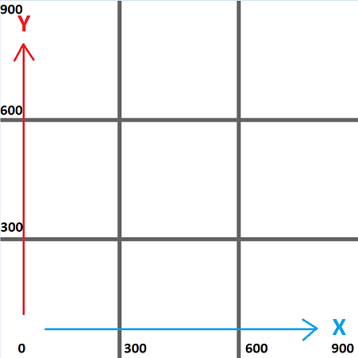
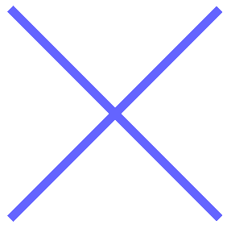
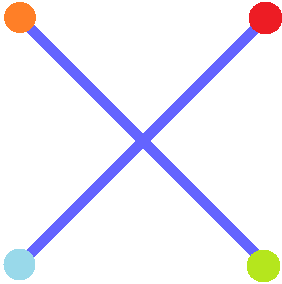
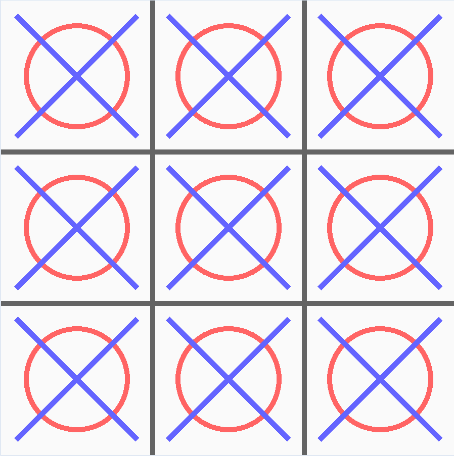

# Tuto Morpion

Apprendre à faire un morpion en go

## Préparation

Copier le dossier ACopier et le renommer en PrénomNom
puis ouvrir le dossier avec l'application vscode

## Comprendre comment ça fonctionne

Il y a une règle à suivre : Avant de modifier le document vérifier qu'il y a bien des étoiles (***) pour te prévenir quand c'est à ton tour d'écrire.

Voici le contenu du fichier morpion.go

```go
package main

import (
	"github.com/faiface/pixel/pixelgl"
)

var nonQuitté bool

func main() {
	nonQuitté = true
	for nonQuitté {
		pixelgl.Run(run)
	}

}

func run() {

}

```

Que veux dire ce code ?

La première ligne: 

```go
package main
```
Pour faire simple, c'est pour dire que notre application se lancera directement car elle contient l'élement principal ```main``` 

---
La ligne suivante:

```go
import (
	"github.com/faiface/pixel/pixelgl"
)
```
C'est pour dire quelles bibliothèques on utilise.

>Mais c'est quoi une bibliothèque ?

C'est un ensemble de fonctions déjà faitent pour éviter de refaire des choses.
>	par exemple : ```math.max(5, 6)``` Cette fonction calcule le maximum entre 2 nombre, c'est plus rapide de l'utilier plutôt que de la refaire. Elle est contenu dans la bibliothèque ```"math"``` que l'on doit ajouter dans l'```import()``` si on l'avais utilisé mais ce n'est pas le cas ici. 

---
La ligne suivante:

```go
var nonQuitté bool
```
C'est une variable global elle servira pour savoir lorsque l'utilisateur quittera le programme.
Les variable globale sont accessible partout dans le programme

Les variables dans ce langage s'écrivent :

```go
var nomDeLaVariable typeDeLaVariable
```
Le type de ```nonQuitté``` est ```bool``` ce qui signife booléen qui à 2 état, *vrai* ou *faux* en anglais *true* et *false*

---
La ligne suivante:

```go
func main() {
	nonQuitté = true
	for nonQuitté {
		pixelgl.Run(run)
	}

}
```
```func``` défini une fonction qui a comme nom ```main()```. C'est aussi le nom de la première fonction appeler dans un programme. Donc c'est ici que tout commence.
Le programme commence à exécuter les actions à partir d'ici.

```go
	nonQuitté = true 
```
Siginifie que la variable qui s'appele ```nonQuitté``` est maintenant égale à *true* donc vrai en français

```go
	for nonQuitte {
		pixelgl.Run(run)
	}
```
En français ça donne tant que nonQuitté égale vrai alors on execute 
```go
		pixelgl.Run(run)
```
Cette ligne appel la bibliothèque graphique que non allons utiliser pour faire le jeu. Cette bibliothèque à son tour appel la fonction ```run()```,
qui est just en dessous et sera la où tout le programme va ce dérouler.

```go
func run() {

}

```


## C'est à toi de jouer maintenant !

On va créer la fenêtre du jeu, pour ce faire il te faut faire 4 choses:
- Configurer les dimensions de la fenêtre et son titre
- Afficher la fenêtre en utilisant la configuration faite juste avant
- Maintenir le programme jusqu'à ce que l'utilisateur clique sur la croix en haut à droite, ce qui va quitter le programme.
- Lorsque l'utilisateur à quitter le programme il faut mettre la variable globale ```nonQuitté``` dans l'autre état c'est à dire *faux* donc *false*


 *** Il faut que tu copie les 4 bout de code qui suivent dans la fonction ```run()``` à la suite.

Ce code là c'est pour configurer la fenêtre avec une dimension de 900x900 (pixels).
Tu peux modifier le titre *Mon_moprion!* par le titre que tu veux.
```go
	cfg := pixelgl.WindowConfig{
		Title:  "Mon_morpion!",
		Bounds: pixel.R(0, 0, 900, 900),
	}
```

Just en dessous tu met ce code qui affiche la fenêtre.
```go
	win, _ := pixelgl.NewWindow(cfg)
```

Encore en dessous tu met ce code qui tourne en boucle tant que personne ne quitte la fenêtre en cliquant sur la croix en haut à droite.
```go

	for win.Closed() == false {

		win.Update()

	}
```

Enfin tu ajoute cette ligne de code pour dire que la fenêre a été fermer au programme.
```go	
	nonQuitté = false
```
---

### Maintenant ton code ressemble à ça :

```go
package main

import (
	"github.com/faiface/pixel/pixelgl"
)

var nonQuitté bool

func main() {
	nonQuitté = true
	for nonQuitté {
		pixelgl.Run(run)
	}

}

func run() {

	cfg := pixelgl.WindowConfig{
		Title:  "Mon morpion!",
		Bounds: pixel.R(0, 0, 900, 900),
	}

	win, _ := pixelgl.NewWindow(cfg)

	for win.Closed() == false {
		win.Update()
	}

	nonQuitté = false
}

```

Si c'est bon tu peux m'appeler et on test ça ensemble :
```bash
>go run morpion.go
```

---

## On va créer le tableau qui va stocker où en est la parti

*** On ajoute un tableau de 3x3 pour stocker ce qui a été jouer en mémoire, dans la fonction ```run()``` au début

```go
	var plateau [3][3]string

	//La ligne en dessous c'est pour que ça fonctionne même si on ne s'en sert pas pour le moment
	plateau = plateau
```

Le tableau créer au dessus est normalement vide ceux qui veux dire que chaque case contient l'élément ```""``` on appelle cet élément **une chaine de caractère vide**


Pour avoir accès à une case du tableau on utilise ```plateau[x][y]```, avec x et y les valeurs de la case que l'on veux.

>***Exemple:***
>|        |**0**|**1**|**2**|**[x]**|
>| :-:    | :-: | :-: | :-: |:-----:|
>|**2**   |  X  |  O  |     |       |
>|**1**   |  X  |     |  X  |       |
>|**0**   |  O  |  X  |  O  |       |
>|**[y]** |     |     |     |       |
>
>Pour avoir accès au rond en bas à gauche on utilisera ```plateau[0][0]```
>
>Pour avoir accès à la croix tout à droite on utilisera ```plateau[2][1]``` 

***On va laisser de côté ce tableau on y reviendra plus tard***


## On va dessiner !!! 

Dessiner mais dessiner quoi ?
On va juste tracer les droites pour faire le morpion car pour le moment tu as juste un écran noir, ce n'est pas très joli.

---

Déjà va sur ce site et choisis les couleurs que tu veux pour le fond et pour les traits.
* [Choisir une couleur](https://www.w3schools.com/colors/colors_picker.asp)

Lorsque tu as trouver la couleur que tu veux pour le fond souvient toi des nombres de cette ligne ```rgb(r, g, b)```, évidement les lettres r, g et b seront des nombres.

Pareil pour la couleur des traits.

On va ajouter une couleur de fond au dessus de la ligne :
```go
		win.Update()
```

Dans la boucle :
```go
	for win.Closed() == false {

		//ici 
		win.Update()
	}
```

*** Ajoute cette ligne remplace les r, g et b par les valeurs de la couleur que tu veux

```go
		win.Clear(color.RGBA{r, g, b, 255})
```

Ca ressemble à ça :
```go
	for win.Closed() == false {

		win.Clear(color.RGBA{250, 250, 250, 255})
		win.Update()
	}
```

Tu peux essayer voir si la couleur de fond fonctionne bien !!

En utilisant le terminal :
```bash
>go run morpion.go
```

---

## On va créer une nouvelle fonction

Au dessus de la fonction ```run()```
```go

//Just ici

func run() {

	var plateau [3][3]string
	plateau = plateau

	cfg := pixelgl.WindowConfig{
		Title:  "Mon morpion!",
		Bounds: pixel.R(0, 0, 900, 900),
	}

	win, _ := pixelgl.NewWindow(cfg)

	for win.Closed() == false {
		win.Clear(color.RGBA{250, 250, 250, 255})
		win.Update()
	}

	nonQuitté = false
}
``` 

*** On va créer cette nouvelle fonction qui va dessiner les traits du morpion

```go

func drawPlateau(win *pixelgl.Window, plateau [3][3]string) {

}

```
*** On déplace les 2 lignes de la fonction ```run()``` dans cette fonction :

```go
		win.Clear(color.RGBA{250, 250, 250, 255})
		win.Update()
```

Maintenant ça ressemeble à ça :

```go

func drawPlateau(win *pixelgl.Window, plateau [3][3]string) {
		
		//On les a mis ici
		win.Clear(color.RGBA{250, 250, 250, 255})
		win.Update()
}

func run() {

	var plateau [3][3]string

	cfg := pixelgl.WindowConfig{
		Title:  "Mon morpion!",
		Bounds: pixel.R(0, 0, 900, 900),
	}

	win, _ := pixelgl.NewWindow(cfg)

	for win.Closed() == false {
		//Elles sont plus là
	}

	nonQuitté = false
}

```

A partir de Maintenant tout le code que l'on va ajouter dans cette fonction on le mettra ici :

```go

func drawPlateau(win *pixelgl.Window, plateau [3][3]string) {
		
		win.Clear(color.RGBA{250, 250, 250, 255})

		//Ici, entre les 2 lignes

		win.Update()
}

```


Pour tracer les lignes du plateau c'est plutot simple il suffit de donner les coordonnés des 2 points de chaque ligne que l'on veut tracer.




Donc on liste les couples de points pour les 4 lignes

On a les 2 lignes verticales sur l'axe ```X``` à 300 et 600 pixels :

> Donc on a	(300, 0) et (300, 900)  comme couple de points pour la ligne sur l'axe des ```X``` 300 pixels
>
>Et on a	(600, 0) et (600, 900)  comme couple de points pour la ligne sur l'axe des ```X``` 600 pixels

Pareil pour les lignes horizontales :
> Donc on a	(0, 300) et (900, 300)  comme couple de points pour la ligne sur l'axe des ```Y``` 300 pixels
>
>Et on a	(0, 600) et (900, 600)  comme couple de points pour la ligne sur l'axe des ```Y``` 600 pixels


*** On ajoute cette ligne dans la fonction ```drawplateau()```, car on ne va pas se servir de cette variable pour le moment.
```go
	plateau = plateau
```

*** On créer une image vide en ajoutant cette ligne à la suite dans la fonction ```drawplateau()```
```go
	imd := imdraw.New(nil)
```

*** On choisi la couleur des traits en ajoutant cette ligne à la suite *(vous pouvez toujours chercher la couleur avec le site vu précédement le lien ci-dessous)*

* [Choisir une couleur](https://www.w3schools.com/colors/colors_picker.asp)
```go
	imd.Color = color.RGBA{100, 100, 100, 255}
```

*** Ensuite il suffit de tracer la ligne dans l'image avec le bon couple de point.

```go
	// la première ligne verticale
	imd.Push(pixel.V(300, 0), pixel.V(300, 900))
	imd.Line(10)

	// la deuxième ligne verticale
	imd.Push(pixel.V(600, 0), pixel.V(600, 900))
	imd.Line(10)

	// la première ligne horizontale
	imd.Push(pixel.V(0, 300), pixel.V(900, 300))
	imd.Line(10)

	// la deuxième ligne horizontale
	imd.Push(pixel.V(0, 600), pixel.V(900, 600))
	imd.Line(10)
	
```

*** Maintenant on affiche cette image à l'écran avec cette ligne

```go
	imd.Draw(win)
```

Votre fonction ```drawPlateau()``` doit ressembler à :

```go
func drawPlateau(win *pixelgl.Window, plateau [3][3]string) {

	win.Clear(color.RGBA{250, 250, 250, 255})

	plateau = plateau

	imd := imdraw.New(nil)

	imd.Color = color.RGBA{100, 100, 100, 255}

	imd.Push(pixel.V(300, 0), pixel.V(300, 900))
	imd.Line(10)

	imd.Push(pixel.V(600, 0), pixel.V(600, 900))
	imd.Line(10)

	imd.Push(pixel.V(0, 300), pixel.V(900, 300))
	imd.Line(10)

	imd.Push(pixel.V(0, 600), pixel.V(900, 600))
	imd.Line(10)

	imd.Draw(win)

	win.Update()
}
```
On va tout de suite utiliser cette fonction dans la fonction ```run()```

*** On ajoute cette ligne dans la boucle ```for``` de ```run()``` just après avoir afficher le fond du plateau.

```go
		drawPlateau(win, plateau)
```

Maintenant ça ressemble à cela :

```go
func run() {

	var plateau [3][3]string

	cfg := pixelgl.WindowConfig{
		Title:  "Mon morpion!",
		Bounds: pixel.R(0, 0, 900, 900),
	}

	win, _ := pixelgl.NewWindow(cfg)

	for win.Closed() == false {

		drawPlateau(win, plateau)

	}

	nonQuitté = false
}

```

Maintenant on test le programme dans le terminal :
```bash
>go run morpion.go
```

## On continue de dessiner !!

Une croix



Donc on commence par créer une nouvelle fonction, 

```go

func drawCroix(win *pixelgl.Window, position pixel.Vec) {

}

```

au dessus de ```run()```

```go

//Just ici

func run() {

	var plateau [3][3]string

	cfg := pixelgl.WindowConfig{
		Title:  "Mon morpion!",
		Bounds: pixel.R(0, 0, 900, 900),
	}

	win, _ := pixelgl.NewWindow(cfg)

	for win.Closed() == false {
		win.Clear(color.RGBA{250, 250, 250, 255})
		win.Update()
	}

	nonQuitté = false
}
``` 
Dans cette fonction on a 4 points à trouver car il y a 2 ligne à tracer :



Sachant que la taille des case est de 300 par 300 pixels, on va décaler les coins de 30 pixels, donc 300 devien 270 et 0 devient 30.
les coordonnées sont toujours dans ce sens(x, y)

> ****
>
> le point ```hautGauche``` (orange) à pour coordonnée (0,300) qui devient (30,270) 
>
> le point ```hautDroite``` (rouge) à pour coordonnée (300,300) qui devient (270,270) 
>
> le point ```basGauche``` (bleu) à pour coordonnée (0,0) qui devient (30,30) 
>
> le point ```basDroite``` (vert) à pour coordonnée (300,0) qui devient (270,30) 
>
>

La fonction qu'on a ajouté ```drawCroix(win *pixelgl.Window, position pixel.Vec)``` prend en paramètre 2 éléments la fenêtre ```win``` et la ```position``` ou l'on va dessiner la croix par son coin inférieur gauche.

Pour savoir où dessiner la croix il faudra donc additionner les positions.

la fonction suivante permet cela :
```go
	imd.SetMatrix(pixel.IM.Moved(position))
```

*** Donc on écrit ce code dans la fonction :

```go
	//On créer l'image ou on va dessiner la croix
	imd := imdraw.New(nil)

	//On choisi la couleur de la croix
	imd.Color = color.RGBA{100, 100, 255, 255}

	//On crée les points de la croix 
	hautGauche := pixel.V(30, 270)
	hautDroite := pixel.V(270, 270)
	basGauche := pixel.V(30, 30)
	basDroite := pixel.V(270, 30)

	//Maintenant on trace les lignes
	imd.Push(hautDroite, basGauche)
	//just avant de la dessiner on deplace les points avec cette fonction
	imd.SetMatrix(pixel.IM.Moved(position))
	//on Trace la ligne avec une épaisseur de 10 pixels de large
	imd.Line(10)

	//On recommence comme avec la ligne du dessus
	imd.Push(hautGauche, basDroite)
	imd.SetMatrix(pixel.IM.Moved(position))
	imd.Line(10)
	
	imd.Draw(win)

```

Donc la fonction ressemble à ça :

```go
func drawCroix(win *pixelgl.Window, position pixel.Vec) {
	imd := imdraw.New(nil)
	imd.Color = color.RGBA{100, 100, 255, 255}

	hautGauche := pixel.V(30, 270)
	hautDroite := pixel.V(270, 270)
	basGauche := pixel.V(30, 30)
	basDroite := pixel.V(270, 30)

	imd.Push(hautDroite, basGauche)
	imd.SetMatrix(pixel.IM.Moved(position))
	imd.Line(10)

	imd.Push(hautGauche, basDroite)
	imd.SetMatrix(pixel.IM.Moved(position))
	imd.Line(10)

	imd.Draw(win)
}
```

*** On fait une autre fonction pour le rond que l'on place en dessous de la fonction que l'on a fait.

```go
func drawRond(win *pixelgl.Window, position pixel.Vec) {

}
```

*** On ajoute comme l'autre fonction, la création de l'image, le choix de la couleur


```go
func drawRond(win *pixelgl.Window, position pixel.Vec) {

	//On créer l'image
	imd := imdraw.New(nil)
	//On choisi la couleur
	imd.Color = color.RGBA{255, 100, 100, 255}

}
```

Pour le cerlce il faut 2 élements le rayon du cercle et le centre

>
>Le centre d'un carré de 300x300 c'est le point de coordonné ```(150, 150)``` 
>
>Le diametre dois être inférieur à 150 sinon on sort du carré, j'ai choisi 100 pixels pour l'exemple.
>

La fonction qui permet de tracer un cercle prend 2 paramètre le rayon et l'épaisseur du trait :

```go
	imd.Circle(100, 10)
```


*** Donc on ajoute ce qu'il faut :

```go
func drawRond(win *pixelgl.Window, position pixel.Vec) {

	imd := imdraw.New(nil)
	imd.Color = color.RGBA{255, 100, 100, 255}

	//On crée le centre 
	centre := pixel.V(150, 150)

	//On ajoute le point du centre dans l'image
	imd.Push(centre)
	
	//On le déplace à la position voulu
	imd.SetMatrix(pixel.IM.Moved(position))

	//On trace le cercle de rayon 100 pixels et d'épaisseur de trait 10 pixels
	imd.Circle(100, 10)

	//On envoie l'image sur l'écran
	imd.Draw(win)

}
```
Voilà maintenant que le rond et la croix sont fait on va les tester.

*** On ajoute cette ligne dans le ```for``` de la fonction ```run()```, et on commente (désactive) la ligne ```drawplateau(win)```

```go
		testCroixRond(win)
```

La fonction ```run()``` ressemble à ça :

```go
func run() {

	var plateau [3][3]string

	cfg := pixelgl.WindowConfig{
		Title:  "Mon morpion!",
		Bounds: pixel.R(0, 0, 900, 900),
	}

	win, _ := pixelgl.NewWindow(cfg)

	for win.Closed() == false {

		//Ligne commenté
		//drawPlateau(win, plateau)

		//L'ajout c'est ici
		testCroixRond(win)
	}

	nonQuitté = false
}

```


On test le programme en utilisant cette commande car on utilise les fonctions ```testrond()``` et ```testCroix()``` qui sont dans un autre fichier


```bash
>go run morpion.go lib.go
```

Le resultat devrais ressembler à ça :




*** On peut supprimer la ligns qu'on viens d'ajouter et décommenter l'autre

```go
func run() {

	var plateau [3][3]string

	cfg := pixelgl.WindowConfig{
		Title:  "Mon morpion!",
		Bounds: pixel.R(0, 0, 900, 900),
	}

	win, _ := pixelgl.NewWindow(cfg)

	for win.Closed() == false {

		//La ligne du dessous est de nouveau parmi nous
		drawPlateau(win, plateau)

		//La ligne n'est plus ici

	}

	nonQuitté = false
}

```

---

## On va afficher le plateau avec les croix et les ronds

Donc on retourne dans la fonction ```drawplateau()```

*** On supprime la ligne : ```plateau = plateau```

Cette fonction ressemble à ça :

```go
func drawPlateau(win *pixelgl.Window, plateau [3][3]string) {

	win.Clear(color.RGBA{250, 250, 250, 255})

	//La ligne n'est plus là

	imd := imdraw.New(nil)

	imd.Color = color.RGBA{100, 100, 100, 255}

	imd.Push(pixel.V(300, 0), pixel.V(300, 900))
	imd.Line(10)

	imd.Push(pixel.V(600, 0), pixel.V(600, 900))
	imd.Line(10)

	imd.Push(pixel.V(0, 300), pixel.V(900, 300))
	imd.Line(10)

	imd.Push(pixel.V(0, 600), pixel.V(900, 600))
	imd.Line(10)

	imd.Draw(win)

	//C'est ici qu'on va ajouter le reste du code de la fonction

	
	win.Update()

}
```
Maintenant en plus de dessiner les traits cette fonction va dessiner les ronds et les croix qui sont dans le tableau ```plateau[x][y]```

Donc la on va faire 2 boucles imbriquées pour parcourir tout le tableau de façon plus rapide.

*** On ajoute ce code en bas de la fonction ```drawPlateau```

```go
	//Ici c'est les 2 boucles imbriquées
	for colonne := 0; colonne < 3; colonne++ {
		for ligne := 0; ligne < 3; ligne++ {

			//Ici les variables colonne et ligne vont prendre toutes les combinaison possible, pour faire simple ont va passer sur toutes les cases du plateau
			
			
			//Ici on calcule les coordonnées des pixels en fonction de leurs positions sur le plateau
			x := float64(colonne) * 300
			y := float64(ligne) * 300


			if plateau[colonne][ligne] == "X" {
				drawCroix(win, pixel.V(x, y))
			}
			if plateau[colonne][ligne] == "O" {
				drawRond(win, pixel.V(x, y))
			}
		}
	}
```

La fonction ressemble a ça :


```go
	
func drawPlateau(win *pixelgl.Window, plateau [3][3]string) {

	imd := imdraw.New(nil)

	imd.Color = color.RGBA{100, 100, 100, 255}

	imd.Push(pixel.V(300, 0), pixel.V(300, 900))
	imd.Line(10)

	imd.Push(pixel.V(600, 0), pixel.V(600, 900))
	imd.Line(10)

	imd.Push(pixel.V(0, 300), pixel.V(900, 300))
	imd.Line(10)

	imd.Push(pixel.V(0, 600), pixel.V(900, 600))
	imd.Line(10)

	imd.Draw(win)

	for colonne := 0; colonne < 3; colonne++ {
		for ligne := 0; ligne < 3; ligne++ {

			x := float64(colonne) * 300
			y := float64(ligne) * 300

			if plateau[colonne][ligne] == "X" {
				drawCroix(win, pixel.V(x, y))
			}
			if plateau[colonne][ligne] == "O" {
				drawRond(win, pixel.V(x, y))
			}
		}
	}
}

```

On va tester cette fonction tout de suite


*** On ajoute la ligne ```testplateau(win)```  de la focntion ```run()``` en dessous ```drawPlateau(win, plateau)```

La fonction ```run()``` ressemeble à ça :

```go

func run() {

	var plateau [3][3]string

	cfg := pixelgl.WindowConfig{
		Title:  "Mon morpion!",
		Bounds: pixel.R(0, 0, 900, 900),
	}

	win, _ := pixelgl.NewWindow(cfg)

	for win.Closed() == false {
		win.Clear(color.RGBA{250, 250, 250, 255})

		drawPlateau(win, plateau)

		//On as ajouter cette ligne
		testplateau(win)

		win.Update()
	}

	nonQuitté = false
}

```

On test le programme en utilisant cette commande car on utilise la fonction ```testplateau()``` qui est dans un autre fichier


```bash
>go run morpion.go lib.go
```


*** Maintenant on peut enlver cette ligne de test.


## Bientôt la fin

*** On ajoute ces lignes au dessus du ```for``` de la fonction ```run()``` : 

```go
	//Variable pour compter le nombre de tour
	tour := 0

	//La valeur de départ est le "O"
	joueurValeur := "O"

	//Si on joue contre quelqu'un d'autre la valeur est "" sinon "O" ou "X" c'est ce que jouera la machine, la on joue contre quelqu'un
	iaValeur := ""

	//C'est pour savoir si c'est fini, pour le moment "pas encore"
	cFini := "pas encore"

	//Cette variable est a vrai (true en anglais) si quelqu'un a bien cliqué
	var valide bool

	//ces 2 variables sont la position d'où a cliqué le dernier joueur
	var x, y int
```


*** On change le "```for win.Closed() == false {```" par :

```go

	//
	for win.Closed() == false && cFini == "pas encore" {

```

*** On ajoute ces ligne dans le ```for``` :

```go

		//On utilise la fonction auProchain() qui renvoie si quelqu'un a cliqué et les coordonnées de la case cliqué 
		valide, x, y = auProchain(win, plateau, joueurValeur, iaValeur)

		//Si quelqu'un a cliqué ...
		if valide {

			//... On ajoute le X ou le O dans la case du plateau qui correspond
			plateau[x][y] = joueurValeur

			//... On ajoute +1 au tour 
			tour = tour + 1

			//... La fonction alors() renvoie si ou quelqu'un à gagner où si les cases sont toutes pleines (ce qui correspond au tour 9) donc l'égalité. 
			cFini = alors(win, plateau, joueurValeur, tour)

			//... On change de joueur, cette fonction change le X en O et inverssement le O en X
			joueurValeur = changeJoueur(joueurValeur)

		}
```

La fonction ```run()``` ressemble a ça :

```go
func run() {

	var plateau [3][3]string

	cfg := pixelgl.WindowConfig{
		Title:  "Mon morpion!",
		Bounds: pixel.R(0, 0, 900, 900),
	}

	win, _ := pixelgl.NewWindow(cfg)

	tour := 0
	joueurValeur := "O"
	iaValeur := "X"
	cFini := "pas encore"
	iaValeur = menu(win)
	var valide bool
	var x, y int


	for win.Closed() == false && cFini == "pas encore" {

		valide, x, y = auProchain(win, plateau, joueurValeur, iaValeur)
		if valide {
			plateau[x][y] = joueurValeur
			tour++
			cFini = alors(win, plateau, joueurValeur, tour)
			joueurValeur = changeJoueur(joueurValeur)

		}

		drawPlateau(win, plateau)

	}

	nonQuitté = false

}
```


On test le programme avec :

- ```iaValeur := "X"```
- ```iaValeur := "O"```
- ```iaValeur := ""```


```bash
>go run morpion.go lib.go
```

## Un Menu


C'est bien embêtant de devoir changer si on joue avec quelqu'un où contre la machine en changeant une ligne, ce serai bien d'avoir un menu

*** On ajoute cette ligne au dessus du ```for``` de la fonction ````run()``` et hop on aura un menu :

```go

	iaValeur = menu(win)

```

On test le programme

```bash
>go run morpion.go lib.go
```


Maintenant on ajoute une fin :

Il suffit de remplacer ```nonQuitté = false``` en bas de la fonction ```run()``` par ```fin(win, cFini)```

```go

func run() {

	var plateau [3][3]string

	cfg := pixelgl.WindowConfig{
		Title:  "Mon morpion!",
		Bounds: pixel.R(0, 0, 900, 900),
	}

	win, _ := pixelgl.NewWindow(cfg)

	tour := 0
	joueurValeur := "O"
	iaValeur := "X"
	cFini := "pas encore"

	var valide bool
	var x, y int

	iaValeur = menu(win)

	for win.Closed() == false && cFini == "pas encore" {

		valide, x, y = auProchain(win, plateau, joueurValeur, iaValeur)
		if valide {
			plateau[x][y] = joueurValeur
			tour++
			cFini = alors(win, plateau, joueurValeur, tour)
			joueurValeur = changeJoueur(joueurValeur)

		}

		drawPlateau(win, plateau)

	}
	//Ici
	fin(win, cFini)

}


```

On verifie ce que ça donne :

```bash
>go run morpion.go lib.go
```


Et voilà c'est fini tu as fait un morpion !!!
